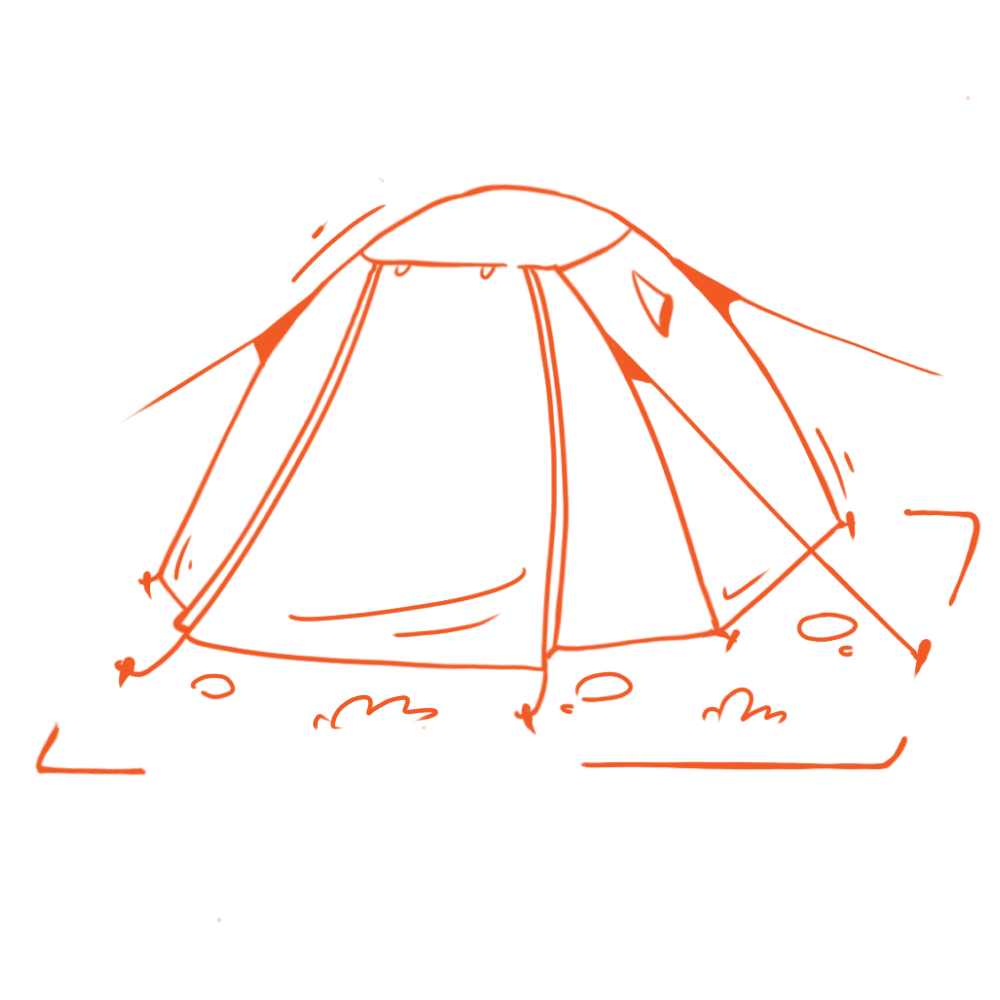
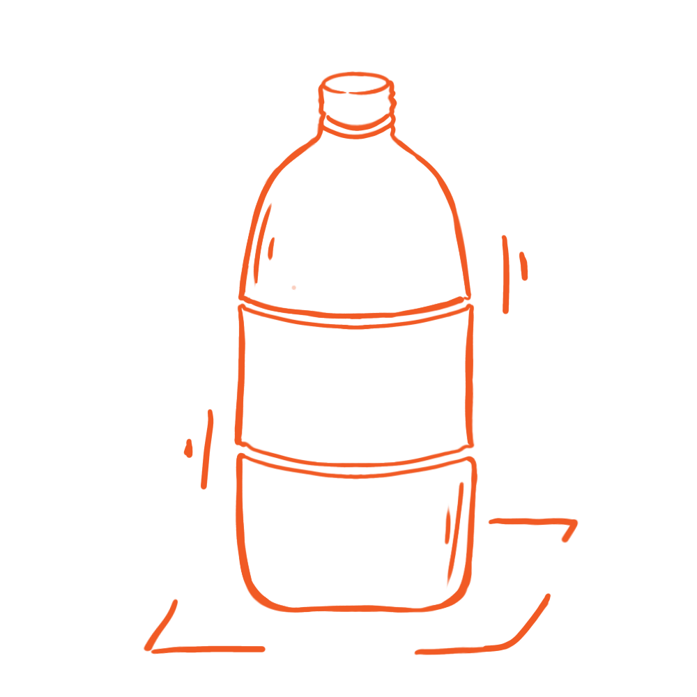
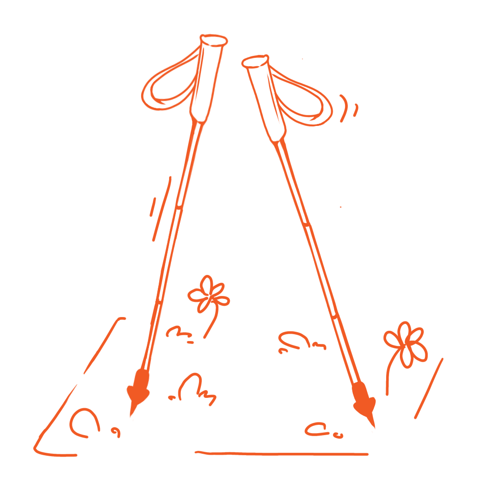
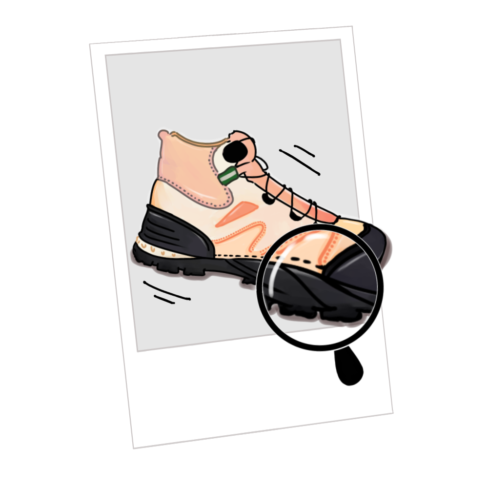
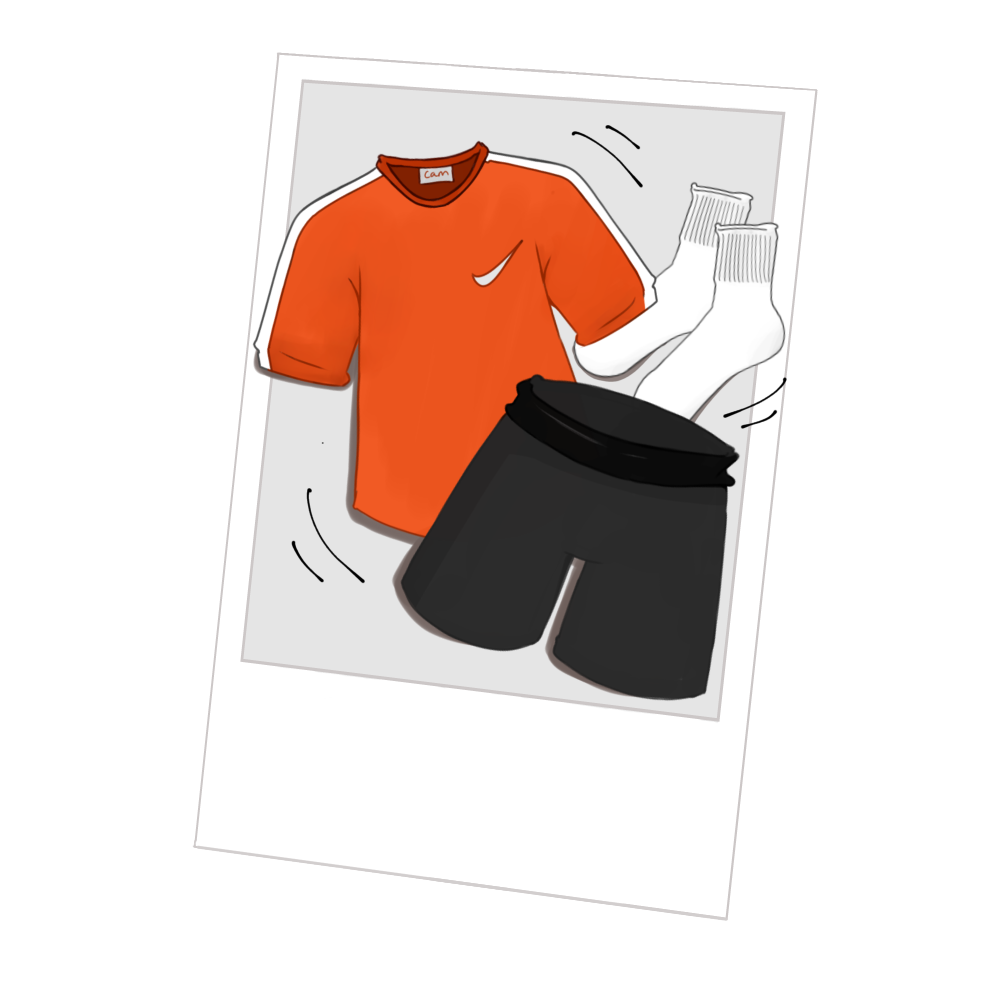
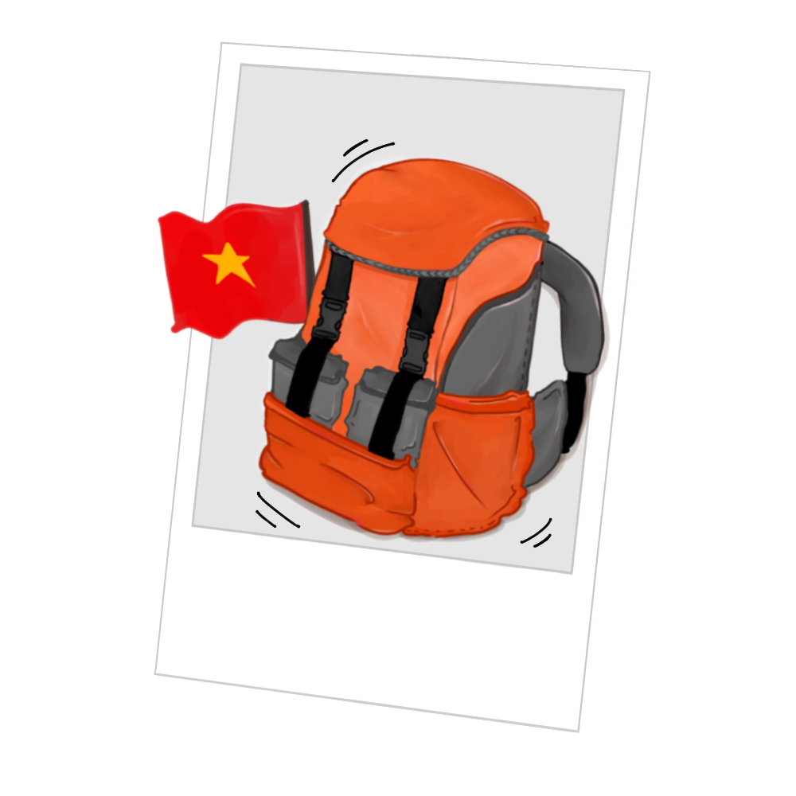
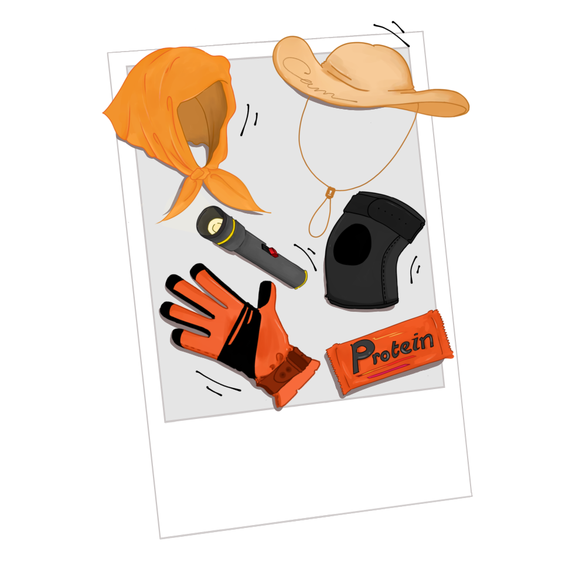

# HÀNH TRANG CHUẨN BỊ & LỊCH TRÌNH CHI TIẾT TÀ NĂNG - PHAN DŨNG
**CAM SITE RETREATS**

Chào Quýt nhỏ thân yêu! Để hành trình băng qua những ngọn đồi cỏ xanh và săn mây Tà Năng - Phan Dũng diễn ra trọn vẹn, an toàn và thoải mái nhất, hãy cùng kiểm tra lại hành trang chuẩn bị và nắm rõ lịch trình di chuyển nhé.

---

## ⛺ 1. NHỮNG THỨ "CAM" ĐÃ CHUẨN BỊ SẴN CHO BẠN (CAM PREPARES)
Bạn không cần mang theo những món đồ cồng kềnh này, CAM sẽ lo toàn bộ khâu hậu cần và setup sẵn tại bãi trại:

  

    
    
Chỗ ngủ ấm áp

    
Lều 2 lớp chống gió mưa, túi ngủ, gối hơi và đệm cách nhiệt.

  

  

    
    
Nước uống dồi dào

    
Nước lọc tinh khiết tiếp tế đầy đủ suốt các chặng di chuyển.

  

  

    
    
Gậy trekking chuyên dụng

    
CAM hỗ trợ mượn gậy trekking miễn phí (báo trước số lượng).

  

  

    
    
Ẩm thực dã ngoại

    
BBQ gà nướng, heo rừng nướng ống tre nóng sốt tại bãi trại.

  

*   **Bảo vệ sức khỏe & An toàn:** 
    *   **Bảo hiểm du lịch mạo hiểm:** Được CAM mua trọn gói cho từng Quýt nhỏ.
    *   **Túi y tế sơ cấp cứu:** Xịt lạnh cơ, bông băng sát trùng, thuốc cảm, hạ sốt, thuốc đau bụng, xịt côn trùng.

---

## 🎒 2. NHỮNG THỨ QUÝT NHỎ CẦN TỰ CHUẨN BỊ (PACKING LIST)
Hành lý cá nhân bạn sẽ tự mang trong balo của mình suốt quãng đường trekking (khoảng 8-12km/ngày), hãy tối giản nhất có thể và khống chế trọng lượng balo dưới **5kg** nhé:

### 👟 Giày và Dép (Quan trọng hàng đầu)
*   [ ] **1 đôi giày trekking bám tốt:** Chọn giày có đế gai sâu chống trơn trượt (không đi giày thời trang đế phẳng). Nên chọn giày **lớn hơn chân từ 1 size** để ngón chân không bị ép vào mũi giày gây đau/tím móng khi xuống dốc.
*   [ ] **1 đôi dép lê hoặc sandal quai hậu:** Mang theo để thay và đi lại nhẹ nhàng, thoáng mát tại khu vực bãi cắm trại vào buổi tối.
*   [ ] **2-3 đôi vớ (tất) thể thao:** Chọn vớ dày dặn để giảm ma sát, tránh làm phồng rộp chân.

  
  
Hình 1: Lựa chọn giày trekking cổ lửng hoặc cổ thấp có đế gai sâu bám tốt

### 👕 Trang phục di chuyển & Trang phục ngủ
*   [ ] **2 bộ quần áo trekking (mặc dọc đường):** Chọn quần dài thể thao co giãn tốt (để tránh gai cào, cỏ tranh cắt và côn trùng), áo thun dài tay mau khô, thoáng khí.
*   [ ] **1 bộ quần áo ấm (mặc buổi tối):** Đồi thông đêm xuống nhiệt độ hạ nhanh, nhiều sương mù và se lạnh. Bạn chuẩn bị 1 bộ đồ thun dài tay và 1 chiếc áo khoác ấm nhẹ (áo phao mỏng hoặc áo gió nỉ) để ngủ ngon nhé.
*   [ ] **1 chiếc áo mưa (Cánh dơi hoặc áo mưa bộ):** Đề phòng những cơn mưa rừng bất chợt vào buổi chiều.
*   [ ] **Nón (mũ) lưỡi trai / nón rộng vành & kính râm:** Che nắng khi đi qua những cung đồi trọc không có bóng cây.

  
  
Hình 2: Trang phục thoáng mát, co giãn để dễ vận động và quần dài tránh trầy xước

### 🔋 Đồ dùng công nghệ & Thiết bị cá nhân
*   [ ] **Balo trekking (Dung tích 20L - 30L):** Nên chọn balo có đai trợ lực hông và ngực để phân tán lực, giúp đỡ mỏi vai gáy. Bắt buộc có **áo trùm chống nước cho balo** (raincover).
*   [ ] **Sạc dự phòng (Dung tích 10.000 - 20.000mAh):** Tà Năng hoàn toàn mất sóng điện thoại và không có điện nguồn. Điện thoại sẽ hao pin rất nhanh do liên tục dò tìm sóng, hãy sạc đầy các thiết bị dự phòng trước khi xuất phát.
*   [ ] **Đèn pin cá nhân (Nên dùng đèn đội đầu):** Rất cần thiết để đi lại vệ sinh hoặc ăn uống tại bãi trại ban đêm khi trời tối hẳn.

  
  
Hình 3: Chọn balo gọn nhẹ, ôm sát lưng có hệ thống đai trợ lực hông hiệu quả

### 🧴 Đồ dùng vệ sinh & Thuốc cá nhân
*   [ ] **Khăn ướt đa năng / Khăn tắm khô:** Do bãi trại giữa rừng sâu hạn chế nước ngọt tắm rửa, bạn nên mang khăn ướt để lau người (tắm khô) giải nhiệt buổi tối.
*   [ ] **Đồ vệ sinh cá nhân mini:** Bàn chải và kem đánh răng cỡ nhỏ, nước rửa tay khô.
*   [ ] **Kem chống nắng & Kem/xịt chống muỗi vắt.**
*   [ ] **Thuốc cá nhân đặc trị:** Nếu bạn có tiền sử bệnh lý riêng (hen suyễn, tim mạch, dị ứng đặc biệt...), bắt buộc phải mang theo thuốc điều trị cá nhân và báo trước cho Leader đoàn nắm thông tin.

  
  
Hình 4: Sạc dự phòng, kem chống nắng, đèn pin và kem bôi chống côn trùng

---

## 📅 3. LỊCH TRÌNH CHI TIẾT HÀNH TRÌNH TÀ NĂNG - PHAN DŨNG (2 ngày 1 đêm)

Nhằm giúp mọi người có sự chuẩn bị tâm lý và nắm rõ các mốc thời gian di chuyển, dưới đây là lịch trình thực tế của đoàn tụi mình:

### 🚌 Ngày 0: Khởi hành đi tìm bình minh đồi cỏ
*   **21h00:** Đón khách tại Trạm Phương Trang - Hàng Xanh.
*   **21h45:** Đón khách tại trạm Phương Trang - Bến Xe Miền Đông Mới.
*   *Lưu ý:* Cả nhà mình cố gắng đến điểm hẹn trước 15-20 phút và giữ điện thoại liên lạc nhé.

### 🥾 Ngày 1: Chinh phục những con dốc và đón hoàng hôn đồi thông
*   **04h30:** Đến điểm dừng chân trung chuyển tại Đức Trọng. Vệ sinh cá nhân, tắm rửa nhẹ nhàng.
*   **05h30:** Thưởng thức bữa sáng nóng hổi với bún/phở bò nạp năng lượng.
*   **06h30:** Lên xe trung chuyển di chuyển 20km tiến sâu vào bìa rừng.
*   **07h30:** Khởi động cơ thể, Leader phổ biến các nguyên tắc an toàn, giới thiệu đội ngũ porters địa phương và chính thức xuất phát trekking.
*   **11h30:** Đoàn dừng chân ăn trưa picnic giản dị trong bóng râm mát của rừng già. Nghỉ ngơi và thư giãn 45 phút.
*   **16h30:** Đến bãi cắm trại (Campsite) của CAM trên đỉnh đồi. Anh chị nhận lều trại, vệ sinh cá nhân, thay đồ khô thoáng ấm áp.
*   **17h30:** Tự do dạo chơi chụp ảnh check-in đồi thông, ngắm hoàng hôn đỏ rực buông xuống thung lũng.
*   **18h30:** Tiệc tối BBQ ấm cúng quanh bếp lửa hồng. Tụi mình cùng ăn thịt heo nướng ống tre, nhâm nhi ly trà gừng nóng và kể nhau nghe những câu chuyện dưới bầu trời đầy sao.

### 🌲 Ngày 2: Săn biển mây, lội suối và trở về
*   **05h30:** Thức dậy sớm đón bình minh se lạnh, ngắm biển sương mù/mây bao phủ đồi cỏ. Thưởng thức một ly trà gừng hoặc cafe pha phin nóng hổi.
*   **06h30:** Ăn sáng nhẹ nhàng đón những tia nắng ấm áp đầu tiên.
*   **07h30:** Dọn dẹp đồ đạc cá nhân, khởi động cơ thể và tiếp tục chặng trekking xuống thung lũng.
*   **11h30:** Đoàn dừng nghỉ bên suối mát. Mọi người ngâm chân thư giãn giải mỏi, ăn trưa nhẹ với cơm nắm, thịt nguội và trái cây.
*   **14h00:** Đến điểm tập kết bãi grab rừng. Mọi người trải nghiệm cảm giác thú vị di chuyển bằng xe máy cày/xe grab rừng của người bản địa 5km ra ngoài.
*   **14h30:** Về đến văn phòng điểm dừng bìa rừng. Tắm rửa nước ngọt, thay quần áo sạch sẽ, ăn bữa chiều nhẹ.
*   **16h00:** Kiểm tra lại hành lý tư trang cá nhân và lên xe giường nằm quay trở về TP.HCM.
*   **23h00:** Xe về đến TP.HCM, kết thúc hành trình trải nghiệm Tà Năng - Phan Dũng đầy kỷ niệm đẹp cùng CAM.

---

## 🌲 4. QUY TẮC "LEAVE NO TRACE" (KHÔNG ĐỂ LẠI DẤU VẾT)
*   Mỗi bạn Quýt nhỏ tự chuẩn bị 1 bình nước cá nhân để rót nước tiếp tế từ CAM, hạn chế tối đa việc sử dụng chai nhựa xài 1 lần thải ra môi trường.
*   Chuẩn bị 1 túi nhỏ để gom rác cá nhân (vỏ kẹo, đầu lọc thuốc lá, khăn ướt) dọc đường đi, mang về bãi trại bỏ vào thùng rác chung của CAM.
