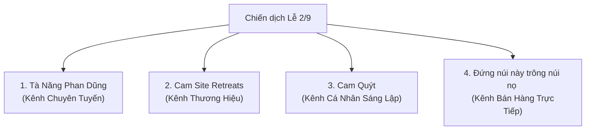

# KẾ HOẠCH MARKETING ĐA KÊNH CHIẾN DỊCH LỄ 2/9
**CAM SITE RETREATS**

Chiến dịch kéo dài 4 tuần nhằm mục đích tối ưu hóa tỷ lệ lấp đầy (100% slots) tất cả các tuyến tour (Tà Năng, Bidoup, Thác Mưa Bay, Langbiang, Yang Đoan) trong kỳ nghỉ lễ Quốc Khánh 2/9.

---

## 🎯 1. MỤC TIÊU CHIẾN DỊCH
*   **Mục tiêu doanh số:** Bán hết 100% chỗ trống của các đoàn khởi hành dịp Lễ 2/9 (từ tối 31/8 - 3/9).
*   **Mục tiêu thương hiệu:** Định vị CAM SITE RETREATS là lựa chọn tour trải nghiệm thiên nhiên chất lượng cao, an toàn và "chữa lành" hàng đầu dịp lễ.

## 💡 1.1 GIÁ TRỊ CỐT LÕI & INSIGHT KHÁCH HÀNG (USP)
Để chạm đúng tâm lý của tệp khách hàng trẻ trung, năng động, mọi nội dung truyền thông và tư vấn bán hàng của CAM phải tập trung nhấn mạnh 3 điểm chạm độc quyền này:
*   **Giới hạn số lượng (Nhóm nhỏ tinh tế):** Cam kết đoàn nhỏ chỉ từ **13 đến tối đa 17 khách** (Không tổ chức các đoàn đông 30-40 người nhồi nhét). Tạo không gian riêng tư, ấm cúng và thân mật như một nhóm bạn đi chơi cùng nhau.
*   **Chụp ảnh đẹp, chữa lành thẩm mỹ:** Guide đi kèm kiêm "phó nháy" hỗ trợ chụp ảnh máy cơ/điện thoại góc chụp xịn xò. Đảm bảo khách có ảnh đẹp lung linh đăng mạng xã hội mà không cần bận tâm chụp ảnh.
*   **Năng động, trẻ trung:** Vibe của tour tươi vui, cởi mở, tập trung vào việc giải tỏa áp lực (stress-relief), trò chuyện chia sẻ tự nhiên quanh lửa trại, không gò bó khuôn mẫu.

---

## 📌 2. ĐỊNH VỊ VÀ PHÂN VAI CỦA 4 KÊNH TRUYỀN THÔNG

Để tránh nội dung bị trùng lặp gây nhàm chán, 4 kênh của bạn sẽ được phân vai và sản xuất nội dung theo các định hướng chuyên biệt:

### 🥾 Kênh 1: TÀ NĂNG PHAN DŨNG (Kênh chuyên cung đường)
*   **Vai trò:** Chuyên gia cung cấp thông tin, cập nhật thời tiết và vẻ đẹp độc quyền của Tà Năng.
*   **Định hướng nội dung:** 
    *   Cập nhật "mùa cỏ xanh" tháng 8-9 tại Tà Năng (đây là thời điểm đồi cỏ xanh ngắt đẹp nhất năm, có nhiều biển mây).
    *   Kinh nghiệm trekking Tà Năng an toàn vào mùa mưa (chuẩn bị giày bám, bọc balo).
    *   Hình ảnh check-in thực tế của khách hàng tại cột mốc 3 tỉnh.
*   **CTA (Kêu gọi hành động):** *"Tour Tà Năng 2/9 đang giới hạn số lượng khách để đảm bảo chất lượng lều trại. Đặt chỗ ngay!"*

### ⛺ Kênh 2: CAM SITE RETREATS (Kênh Branding thương hiệu)
*   **Vai trò:** Khẳng định uy tín, chất lượng dịch vụ cao cấp và tiêu chuẩn an toàn nghiêm ngặt.
*   **Định hướng nội dung:**
    *   Showcase cận cảnh setup lều trại (lều chống thấm nước 2 lớp, đệm êm, túi ngủ ấm áp đề phòng mưa rừng).
    *   Cận cảnh chuẩn bị ẩm thực dã ngoại: Tiệc BBQ nướng bên bếp lửa hồng, lẩu gà lá é bốc khói giữa trời se lạnh.
    *   Giới thiệu đội ngũ Guide chuyên nghiệp, tận tâm và quy trình an toàn sơ cấp cứu cứu hộ.
*   **CTA:** *"Trải nghiệm kỳ nghỉ lễ trọn vẹn, không lo lắng chuẩn bị. Đặt tour chất lượng cao cùng CAM SITE RETREATS."*

### 🍊 Kênh 3: CAM QUÝT (Kênh thương hiệu cá nhân của Founder)
*   **Vai trò:** Kết nối cảm xúc, kể chuyện hậu trường (Behind-the-scenes), chia sẻ quan điểm sống và đam mê xê dịch.
*   **Định hướng nội dung:**
    *   Kể câu chuyện: *"Tại sao mình từ bỏ công việc văn phòng để đi dựng trại giữa rừng?"*
    *   Chia sẻ những khoảnh khắc vui vẻ, chân thực cùng khách hàng và hướng dẫn viên bản địa trong các tour trước.
    *   Nhật ký chuẩn bị cho chiến dịch lễ 2/9: Đi tiền trạm kiểm tra đường dốc, chọn bãi trại an toàn nhất, chuẩn bị mua thực phẩm tươi sạch cho khách.
*   **CTA:** Bán hàng gián tiếp bằng kể chuyện (Storytelling): *"Lễ này nếu bạn chưa biết đi đâu trốn phố, về rừng cắm trại cùng Quýt nhé!"*

### 🏔️ Kênh 4: ĐỨNG NÚI NÀY TRÔNG NÚI NỌ (Kênh Sale trực tiếp & Tổng hợp)
*   **Vai trò:** Đưa ra các bảng so sánh tour, cập nhật lịch khởi hành trực quan, đếm ngược số chỗ trống và chốt đơn trực tiếp.
*   **Định hướng nội dung:**
    *   Bài viết so sánh: *"Lễ 2/9 nên chọn Tà Năng đồi cỏ hay Bidoup rừng sâu? Đâu là cung đường dành cho bạn?"*
    *   Giới thiệu các tour ngắn ngày chi phí tối ưu khác như: Thác Mưa Bay (1 ngày 1 đêm), Yang Đoan, Langbiang.
    *   Đăng tải liên tục bảng cập nhật số chỗ còn trống (Ví dụ: *"Tà Năng 2/9: Đoàn 1 còn 3 chỗ, Đoàn 2 còn 5 chỗ..."*).
*   **CTA:** Thúc đẩy hành động nhanh: *"Nhận ngay ưu đãi nhóm khi đăng ký trước ngày 15/8!"*

---

## 📅 3. LỘ TRÌNH TRIỂN KHAI CHI TIẾT (4 TUẦN TRƯỚC LỄ 2/9)

### ⏱️ TUẦN 1 (01/08 - 07/08): KHƠI GỢI NHU CẦU & TEASING (Gieo mầm)
*   **Chủ đề:** *"Lễ 2/9 này bạn trốn đi đâu?"*
*   **Nhiệm vụ các kênh:**
    *   **Cam Quýt:** Video tâm sự về cảm giác ngột ngạt trước mỗi kỳ nghỉ lễ dài ngày khi các điểm du lịch lớn (Đà Lạt, Vũng Tàu) đều đông nghịt người kẹt cứng. Đề xuất phương án "Trốn phố về rừng".
    *   **Tà Năng Phan Dũng:** Đăng bộ ảnh đồi cỏ xanh ngắt tháng 8 đón sương sớm cực chill, kích thích thị giác.
    *   **Đứng núi này trông núi nọ:** Đăng tải lịch khởi hành sơ bộ dịp lễ 2/9 của tất cả các tuyến tour.
    *   **Cam Site Retreats:** Đăng video ngắn giới thiệu không gian bãi cắm trại biệt lập, yên tĩnh tuyệt đối dịp lễ.

### ⏱️ TUẦN 2 (08/08 - 14/08): CHỨNG MINH TRẢI NGHIỆM & GIẢI QUYẾT NỖI SỢ (Xây dựng niềm tin)
*   **Chủ đề:** *"Đi cắm trại mùa mưa có an toàn và sướng không?"* (Giải quyết rào cản thời tiết tháng 9).
*   **Nhiệm vụ các kênh:**
    *   **Cam Site Retreats:** Đăng tải quy trình an toàn mùa mưa, giới thiệu hệ thống lều bạt chống mưa bão cao cấp và túi sơ cứu y tế.
    *   **Tà Năng Phan Dũng:** Chia sẻ kinh nghiệm đi rừng mùa mưa (cách chọn tất chống vắt, cách đi dốc đất sét không trơn).
    *   **Cam Quýt:** Video hậu trường nướng gà ống tre dưới hiên lều cắm trại lúc trời mưa lâm thâm, nhâm nhi ly trà gừng ấm nóng (Tạo cảm giác lãng mạn, ấm cúng).
    *   **Đứng núi này trông núi nọ:** So sánh chi tiết mức độ tốn thể lực của các cung tour để khách chọn cung phù hợp nhất.

### ⏱️ TUẦN 3 (15/08 - 21/08): BÁN HÀNG TẬP TRUNG & TẠO SỰ KHAN HIẾM (Chốt đơn mạnh mẽ)
*   **Chủ đề:** *"Sắp hết vé xe giường nằm - Số chỗ còn lại đếm ngược"*
*   **Nhiệm vụ các kênh:**
    *   **Đứng núi này trông núi nọ:** Chạy liên tục các bài đăng đếm ngược số chỗ (Ví dụ: *"Chỉ còn 4 slot cuối cùng xe Limousine đi Tà Năng ngày 31/8"*). Công bố chính sách ưu đãi nhóm (giảm giá từ nhóm 4 người).
    *   **Tà Năng Phan Dũng:** Video POV săn mây buổi sáng sớm đẹp hút hồn. Nhắc nhở khách lễ 2/9 năm nay mây rất dày.
    *   **Cam Quýt:** Bài viết tâm sự: *"Lễ này Quýt sẽ trực tiếp làm Tour Leader dẫn đoàn Tà Năng, bạn nào muốn đi cùng Quýt thì đăng ký sớm nha!"* (Dùng uy tín cá nhân hút khách).
    *   **Cam Site Retreats:** Đăng tải feedback bằng video của các đoàn khách trước khen ngợi chất lượng phục vụ của CAM.

### ⏱️ TUẦN 4 (22/08 - 30/08): LAST CALL & CHUẨN BỊ VẬN HÀNH (Chốt đoàn & Khóa sổ)
*   **Chủ đề:** *"Chuẩn bị balo và lên đường!"*
*   **Nhiệm vụ các kênh:**
    *   **Đứng núi này trông núi nọ / Cam Site Retreats:** Khóa sổ nhận đăng ký. Gửi email và tin nhắn Zalo xác nhận cuối cùng cho toàn bộ khách hàng.
    *   **Tà Năng Phan Dũng:** Livestream ngắn cập nhật tình hình đồi cỏ và thời tiết thực tế tại bìa rừng.
    *   **Cam Quýt:** Video cảnh xếp balo chuẩn bị đi tour, chia sẻ danh mục những món đồ công nghệ không nên mang theo để có một chuyến đi ngắt kết nối hoàn hảo.

---

## 🎬 4. LỘ TRÌNH CHI TIẾT 2-3 CLIP MỖI TUẦN (VIDEO CALENDAR)

Để tăng độ tiếp cận, mỗi tuần bạn cần đăng tải đều đặn từ 2 đến 3 video ngắn (TikTok/Reels/Shorts). Dưới đây là lộ trình sản xuất cụ thể:

### 📅 TUẦN 1: KÍCH THÍCH NHU CẦU & CHỐT LỊCH SỚM

#### 🎥 Clip 1: "Kỳ nghỉ lễ trong mơ vs. Thực tế"
*   **Kênh đăng đề xuất:** **Cam Quýt (Thương hiệu cá nhân)** hoặc **Đứng núi này trông núi nọ**
*   **Visual Hook (3 giây đầu):** Quay cảnh bóp còi kẹt xe ầm ĩ hoặc cảnh chen chúc mệt mỏi ở bãi biển ➡️ Cắt chuyển cảnh lia máy rộng ngắm đồi thông xanh ngắt, gió thổi nhẹ rì rào.
*   **Nội dung:** Kể chuyện: *"Lễ này bạn chọn chen chúc kẹt xe 5 tiếng ở Vũng Tàu, hay chọn ngắt kết nối nằm nghe tiếng thông reo cùng Quýt? Lễ 2/9 đang đến rất gần, đừng để sát ngày mới cuống cuồng tìm chỗ trốn."*
*   **Hashtag:** #camsiteretreats #camquyt #trondulichle #trekkingtanang

#### 🎥 Clip 2: "Cập nhật màu cỏ Tà Năng mới nhất tháng 8"
*   **Kênh đăng đề xuất:** **Tà Năng Phan Dũng (Kênh chuyên tuyến)**
*   **Visual Hook (3 giây đầu):** Cảnh quay Flycam lướt qua những đồi cỏ xanh mướt trải dài như thảo nguyên Mông Cổ dưới ánh nắng vàng.
*   **Nội dung:** Cập nhật tình hình thực tế: *"Đây là màu cỏ Tà Năng Phan Dũng thời điểm hiện tại. Mưa xuống giúp đồi cỏ xanh ngắt trở lại, sương mù ngập tràn các thung lũng vào sáng sớm. Đây chính là mùa đẹp nhất trong năm để trekking."*
*   **Hashtag:** #tanangphandung #dulichlamdong #trekkingvietnam #sanmay

#### 🎥 Clip 3: "Ăn gì khi đi cắm trại cao cấp với CAM?"
*   **Kênh đăng đề xuất:** **Cam Site Retreats (Kênh Branding)**
*   **Visual Hook (3 giây đầu):** Cận cảnh miếng thịt heo rừng nướng trên ống tre xèo xèo bốc khói, chấm muối ớt xanh đặc sản.
*   **Nội dung:** Review ẩm thực dã ngoại: *"Nhiều người nghĩ đi rừng chỉ ăn mì gói qua bữa. Nhưng với CAM, bạn sẽ được thưởng thức tiệc BBQ thịnh soạn: gà đồi nướng mật ong, thịt nướng ống tre, bắp nướng mỡ hành và nồi cháo nóng hổi sưởi ấm đêm lạnh."*
*   **Hashtag:** #glamping #amthucdangoai #bbqgiuarung #camsite

---

### 📅 TUẦN 2: CHỐNG LẠI NỖI SỢ & HOÀN THIỆN NIỀM TIN

#### 🎥 Clip 4: "Mưa rừng Tà Năng có đáng sợ như bạn nghĩ?"
*   **Kênh đăng đề xuất:** **Tà Năng Phan Dũng** hoặc **Cam Site Retreats**
*   **Visual Hook (3 giây đầu):** Cảnh trời mưa sầm sập ➡️ Cắt cảnh khách ngồi thảnh thơi uống cafe nóng dưới bạt che khổng lồ của trại, ngắm mưa rơi lãng mạn.
*   **Nội dung:** Giải quyết nỗi sợ thời tiết: *"Đi trekking mùa mưa sợ nhất là ướt và lạnh. Nhưng mưa cao nguyên thường nhanh tạnh, mang lại những biển mây tuyệt đẹp vào sáng hôm sau. CAM đã chuẩn bị sẵn hệ thống bạt che mưa chịu lực và lều chống nước 2 lớp để bạn yên tâm tận hưởng."*
*   **Hashtag:** #trekkingmuamua #an-toan-tren-het #kinhnghiemdirung

#### 🎥 Clip 5: "Hướng dẫn đóng gói balo trekking nhẹ tênh cho người mới"
*   **Kênh đăng đề xuất:** **Cam Quýt**
*   **Visual Hook (3 giây đầu):** Quýt đổ một đống đồ đạc ra sàn và bắt đầu hướng dẫn cách xếp đồ khoa học vào balo.
*   **Nội dung:** Chia sẻ kinh nghiệm thực tế: *"Quy tắc 3-2-1 khi chuẩn bị đồ đi rừng: 3 bộ quần áo mau khô, 2 đôi tất dày chống vắt, và 1 chiếc đèn pin đeo trán. Xem hết video này để không mang thừa những món đồ vô dụng làm nặng vai nhé!"*
*   **Hashtag:** #huongdanxepbalo #packinglist #camquytsharing

#### 🎥 Clip 6: "Nỗi sợ thầm kín: Đi vệ sinh giữa rừng thế nào?"
*   **Kênh đăng đề xuất:** **Đứng núi này trông núi nọ**
*   **Visual Hook (3 giây đầu):** Gương mặt e ngại của một bạn nữ ➡️ Cắt cảnh chỉ vào chiếc lều vệ sinh di động xinh xắn được dựng kín đáo bên rặng thông.
*   **Nội dung:** Hài hước giải đáp thắc mắc: *"Hỏi thật đi, có phải bạn ngại đi trekking vì sợ khoản vệ sinh không? Đừng lo, CAM đã thiết kế phòng vệ sinh dã ngoại kín gió, sạch sẽ, có vòi xịt và bồn tự hoại sinh học phân hủy 100% không để lại rác thải ra thiên nhiên."*
*   **Hashtag:** #traveltips #trekkingquestions #giaidapthacmac

---

### 📅 TUẦN 3: BÁN HÀNG TẬP TRUNG & TẠO SỰ KHAN HIẾM

#### 🎥 Clip 7: "So sánh Tà Năng và Bidoup Tà Giang"
*   **Kênh đăng đề xuất:** **Đứng núi này trông núi nọ**
*   **Visual Hook (3 giây đầu):** Chia đôi màn hình: Một bên là đồi cỏ dốc thoải Tà Năng, một bên là rừng rêu cổ thụ hiểm trở Bidoup.
*   **Nội dung:** Tư vấn chọn tour: *"Lễ này chọn Tà Năng hay Bidoup? Tà Năng dốc thoải, cảnh rộng bao la thích hợp chụp ảnh chill. Bidoup nhiều dốc đứng, rừng rêu nguyên sinh thích hợp cho các trekking chuyên nghiệp thích thử thách. Bạn thuộc team nào?"*
*   **Hashtag:** #sosanhdulich #bidouptagiang #tanangphandung

#### 🎥 Clip 8: "Cảnh báo: Chỉ còn đúng 5 vé xe đi Tà Năng lễ 2/9"
*   **Kênh đăng đề xuất:** **Đứng núi này trông núi nọ** hoặc **Tà Năng Phan Dũng**
*   **Visual Hook (3 giây đầu):** Quay màn hình giao diện đặt chỗ của website CAM hiển thị thông báo màu đỏ "Chỉ còn 3 chỗ trống" ➡️ Cảnh mọi người đang vui vẻ leo núi.
*   **Nội dung:** Tạo sự khan hiếm: *"Tin buồn là vé xe giường nằm đi Lâm Đồng dịp lễ 2/9 gần như đã cháy sạch. Tin vui là CAM vẫn còn giữ lại được 5 slot cuối cùng cho đoàn khởi hành tối 31/8. Đăng ký nhóm 4 người còn được nhận ưu đãi giảm giá đặc biệt. Nhanh tay inbox giữ chỗ ngay!"*
*   **Hashtag:** #dulichle29 #camsiteretreats #chotdoanle #vé-vớt

#### 🎥 Clip 9: "Gặp gỡ đội ngũ Porters - Những người hùng thầm lặng của CAM"
*   **Kênh đăng đề xuất:** **Cam Quýt** hoặc **Cam Site Retreats**
*   **Visual Hook (3 giây đầu):** Hình ảnh anh Porter người đồng bào cười thật tươi, trên lưng cõng gùi đồ nặng 30kg bước đi thoăn thoắt trên dốc núi.
*   **Nội dung:** Storytelling ấm áp: *"Họ là những người dậy sớm nhất để chuẩn bị nước ấm, gùi thực phẩm tươi lên đỉnh đồi trước khi khách tới và luôn nở nụ cười hiền hậu tiếp thêm động lực cho đoàn. Đi tour với CAM không chỉ là ngắm cảnh, mà còn là câu chuyện kết nối con người."*
*   **Hashtag:** #porters #nguoibandian #cauchuongdirung #camsitehumans

---

### 📅 TUẦN 4: LAST CALL & CHUẨN BỊ LÊN ĐƯỜNG

#### 🎥 Clip 10: "Hành trình đóng gói đồ ăn tươi chuẩn bị lên rừng phục vụ lễ 2/9"
*   **Kênh đăng đề xuất:** **Cam Quýt**
*   **Visual Hook (3 giây đầu):** Cảnh Quýt cùng đội hậu cần đóng gói hút chân không từng tảng thịt ba chỉ tươi ngon, xếp đá lạnh bảo quản cẩn thận vào thùng xốp.
*   **Nội dung:** Chứng minh chất lượng: *"Lễ này CAM đón tổng cộng 4 đoàn đi rừng. Để đảm bảo đồ ăn luôn tươi ngon nhất khi lên tới đỉnh đồi, tất cả thịt và rau củ đều được sơ chế sạch sẽ, hút chân không và vận chuyển liên tục bằng thùng bảo ôn trong đêm. Hẹn gặp các bạn ở bìa rừng nhé!"*
*   **Hashtag:** #behindthescenes #chuanbitourle #camquytlife #glampingvn

#### 🎥 Clip 11: "Review từ khách hàng đã đi tour CAM"
*   **Kênh đăng đề xuất:** **Cam Site Retreats**
*   **Visual Hook (3 giây đầu):** Video phỏng vấn ngắn khách hàng vừa bước ra khỏi rừng, mặt lấm lem bùn đất nhưng cười cực tươi: "Mệt nhưng xứng đáng lắm mọi người ơi!"
*   **Nội dung:** Khách hàng chia sẻ: *"Xem các bạn khách cũ nói gì sau 2 ngày ngắt kết nối internet tại Tà Năng cùng CAM. Không sóng điện thoại, không deadline, chỉ có tình bạn và thiên nhiên hoang sơ."*
*   **Hashtag:** #customerfeedback #reviewdulich #cam-on-camsite

---

## 💡 5. HOOKS TIÊU BIỂU DÀNH CHO CÁC KÊNH TIKTOK/REELS (MẪU CÂU TIÊU ĐỀ)

1.  **Kênh Tà Năng Phan Dũng:**
    *   *"Sự thật về Tà Năng Phan Dũng dịp lễ 2/9: Có thực sự đông đúc và xô bồ như bạn nghĩ?"*
    *   *"Cập nhật màu cỏ Tà Năng tuần này: Đã đến lúc xách balo đi săn mây chưa?"*
2.  **Kênh Cam Site Retreats:**
    *   *"Tại sao đi trekking cắm trại với CAM lại không sợ đói và lạnh?"*
    *   *"Review chân thực lều vệ sinh tự hoại sinh học giữa đỉnh đồi của CAM SITE RETREATS."*
3.  **Kênh Cam Quýt:**
    *   *"Tại sao Quýt khuyên bạn nên thử một lần tắt mạng điện thoại trong 48 tiếng?"*
    *   *"Nhật ký một ngày chuẩn bị hậu cần cho 50 khách đi tour lễ 2/9 của tụi mình có gì?"*
4.  **Kênh Đứng núi này trông núi nọ:**
    *   *"So sánh Bidoup Tà Giang và Tà Năng: Cung nào đáng đi hơn dịp lễ này?"*
    *   *"Top 3 cung tour ngắn ngày cực chill đi từ Sài Gòn chỉ mất 1 đêm xe dịp 2/9."*
