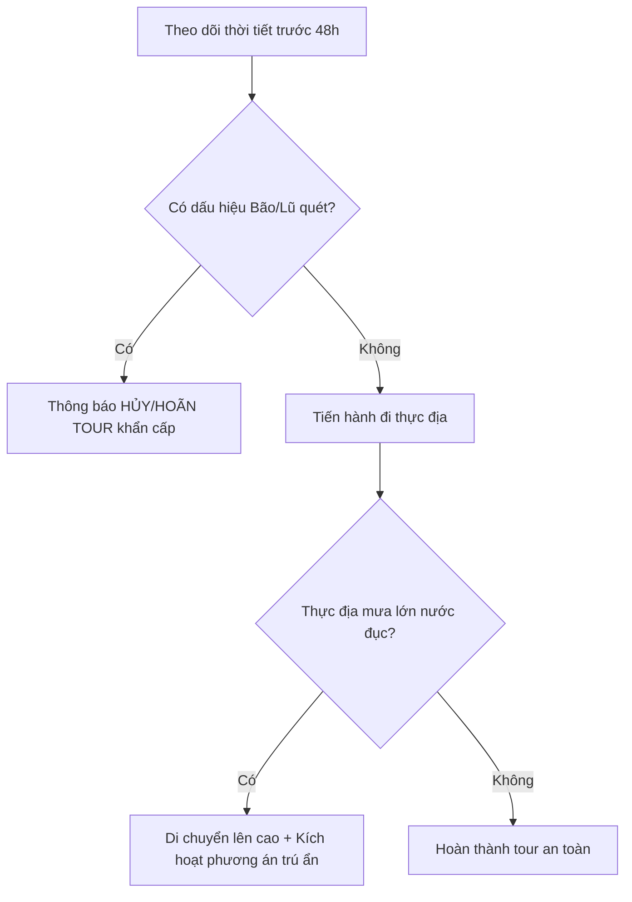

# QUY TRÌNH VẬN HÀNH AN TOÀN & CỨU HỘ KHẨN CẤP (SAFETY & RESCUE SOP)
**CAM SITE RETREATS**

Tài liệu này thiết lập các tiêu chuẩn an toàn nghiêm ngặt và quy trình xử lý khẩn cấp bắt buộc đối với tất cả Hướng dẫn viên (Guide), nhân sự hỗ trợ (Porters/Hậu cần) tại thực địa.

---

## MỤC LỤC
1. Tiêu chuẩn trang thiết bị bảo hộ bắt buộc (PPE)
2. Quy trình xử lý và theo dõi thời tiết thực địa
3. Hướng dẫn sơ cấp cứu & Trang bị y tế bắt buộc
4. Quy trình ứng phó tình huống khẩn cấp (SOS & Rescue)
5. Hotline cứu hộ địa phương theo tuyến tour

---

## 1. TIÊU CHUẨN TRANG THIẾT BỊ BẢO HỘ BẮT BUỘC (PPE)

Mỗi dòng tour có tiêu chuẩn thiết bị an toàn riêng. Tất cả thiết bị phải được kiểm tra chất lượng trước giờ xuất phát 60 phút.

### A. Tuyến Tour Trekking (Tà Năng, Bidoup, Thác Mưa Bay)
*   **Thiết bị cho Hướng dẫn viên:**
    *   1 Bộ đàm liên lạc tầm xa (bán kính hoạt động tối thiểu 5km trong điều kiện rừng núi).
    *   1 Bản đồ giấy và thiết bị GPS cầm tay (hoặc điện thoại có tải sẵn bản đồ offline như Gaia GPS / WikiLoc).
    *   1 Đèn pin siêu sáng (độ sáng tối thiểu 1000 Lumens) + 1 bộ pin dự phòng.
    *   1 Còi cứu sinh độ vang cao.
    *   1 Túi cứu thương cá nhân chuyên dụng (đeo hông).
*   **Thiết bị hỗ trợ cho Khách hàng:**
    *   Gậy trekking trợ lực (được CAM cung cấp miễn phí nếu khách có nhu cầu).
    *   Đèn pin đội đầu (cho các tour ngủ đêm).
    *   Áo mưa cánh dơi/áo mưa bộ siêu nhẹ.
---

## 2. QUY TRÌNH THEO DÕI THỜI TIẾT THỰC ĐỊA

Trưởng nhóm điều hành (Tour Leader) có nhiệm vụ theo dõi và đưa ra quyết định tiếp tục hoặc hủy tour dựa trên thời tiết:

### Các chỉ số cảnh báo nguy hiểm bắt buộc dừng hoạt động:
1.  **Dòng nước đổi màu đục đỏ (rất nguy hiểm):** Đây là dấu hiệu chắc chắn của lũ quét từ thượng nguồn đổ về. Bắt buộc tất cả Guide dừng hoạt động tắm thác/vượt thác ngay lập tức, điều hướng toàn bộ khách lên các khu vực đồi cao an toàn.
2.  **Mưa dông có sấm sét lớn trên đồi cỏ (Tà Năng):** Đồi cỏ Tà Năng là khu vực trống trải, nguy cơ sét đánh rất cao. Guide phải hướng dẫn khách hạ thấp độ cao, tháo bỏ các vật dụng kim loại (gậy trekking), không trú ẩn dưới các cây cổ thụ đứng đơn độc.

---

## 3. HƯỚNG DẪN SƠ CẤP CỨU & TRANG BIỆT Y TẾ BẮT BUỘC

Mỗi đoàn đi tour phải trang bị 1 túi y tế chuyên dụng chứa đầy đủ các danh mục sau:

| Loại dụng cụ | Tên chi tiết | Số lượng tối thiểu | Mục đích sử dụng |
| :--- | :--- | :--- | :--- |
| **Băng bó chấn thương** | Băng thun y tế (co giãn tốt) | 3 cuộn | Cố định khớp khi bong gân, chệch khớp. |
| | Băng gạc vô trùng | 10 miếng | Đắp vết thương hở tránh nhiễm trùng. |
| | Băng cá nhân nhiều kích cỡ | 2 hộp | Bịt các vết xước nhỏ do gai cào. |
| **Thuốc sát trùng** | Cồn đỏ (Povidine) / Cồn 70 độ | 1 chai mỗi loại | Sát khuẩn vết thương trước khi băng bó. |
| **Dụng cụ cố định** | Nẹp gỗ/nẹp nhựa thông minh | 2 cái | Cố định xương gãy (tay/chân) tạm thời. |
| **Thuốc uống thông dụng** | Paracetamol 500mg | 2 vỉ | Hạ sốt, giảm đau nhanh. |
| | Berberin / Smecta | 2 vỉ | Xử lý rối loạn tiêu hóa, đau bụng đi ngoài. |
| | Thuốc xịt chống muỗi, côn trùng | 1 chai | Ngăn ngừa côn trùng đốt trong rừng sâu. |

---

## 4. QUY TRÌNH ỨNG PHÓ TÌNH HUỐNG KHẨN CẤP (EMERGENCY PLAN)

Khi xảy ra tai nạn chấn thương nặng hoặc khách mất tích, Guide phải kích hoạt ngay quy trình 4 bước sau:

### Bước 1: Ổn định và Sơ cứu tại chỗ
*   Đánh giá mức độ chấn thương của nạn nhân. Thực hiện sơ cứu cầm máu, cố định xương gãy hoặc hà hơi thổi ngạt nếu ngạt nước.
*   Trấn an tâm lý nạn nhân và đảm bảo an toàn cho các thành viên còn lại trong đoàn (không để xảy ra hoảng loạn dây chuyền).

### Bước 2: Liên lạc cứu hộ khẩn cấp
*   Guide chốt đoàn di chuyển nhanh đến điểm có sóng điện thoại gần nhất (hoặc sử dụng bộ đàm/thiết bị vệ tinh nếu có) để gọi điện về văn phòng điều hành của CAM SITE RETREATS và liên hệ Hotline cứu hộ địa phương.
*   **Thông tin cung cấp khi gọi SOS:**
    1.  Tên tuyến tour và vị trí tọa độ GPS hiện tại (hoặc mốc thực địa nổi bật như Dốc Dầu, Đồi Lính, Thác 2...).
    2.  Số lượng người bị nạn, tình trạng chấn thương (tỉnh táo, bất tỉnh, mất máu...).
    3.  Tình hình thời tiết hiện tại tại khu vực gặp nạn.

### Bước 3: Di chuyển nạn nhân ra điểm tiếp cận
*   Nếu nạn nhân bị chấn thương cột sống: **Tuyệt đối không tự ý di chuyển** trừ khi có cán cáng chuyên dụng và nẹp cổ.
*   Nếu địa hình hiểm trở xe cứu thương không vào được (như lõi rừng Tà Năng): Sử dụng võng bạt cứu hộ chuyên dụng để khiêng nạn nhân ra điểm trung chuyển mà xe máy cày/xe địa phương có thể tiếp cận được.

### Bước 4: Bàn giao y tế và Báo cáo sự cố
*   Bàn giao nạn nhân cho nhân viên y tế địa phương và xe cấp cứu.
*   Guide trưởng tiến hành ghi biên bản sự cố gửi về Ban Giám đốc trong vòng 24h sau khi sự cố xảy ra.

---

## 5. HOTLINE CỨU HỘ ĐỊA PHƯƠNG THEO TUYẾN TOUR

Tất cả hướng dẫn viên phải lưu các số điện thoại này vào danh bạ trước khi khởi hành:

### Tuyến Tà Năng - Phan Dũng:
*   **Trạm Y tế Xã Đa Quyn (Lâm Đồng - Điểm đầu tuyến):** 02633.984.115
*   **Ủy ban Nhân dân Xã Phan Dũng (Bình Thuận - Điểm cuối tuyến):** 02523.860.101
*   **Đội xe máy cày hỗ trợ cứu hộ Phan Dũng (Anh Út):** 0984.756.241

